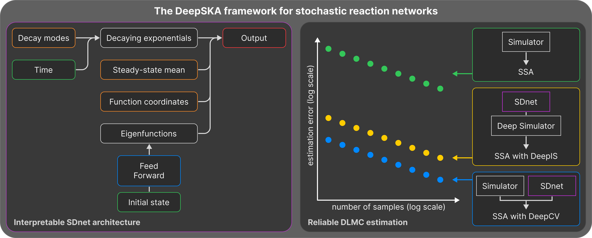

# DeepSKA

This code provides access to DeepSKA, the deep learning framework described in the [Interpretable Neural Approximation of Stochastic Reaction Dynamics with Guaranteed Reliability](https://doi.org/10.48550/arXiv.2512.06294) paper.



## Installation & running an existing config

### Prerequisites

- [`python`](https://www.python.org/) (version 3.13 or higher)
- [`uv`](https://github.com/astral-sh/uv) (fast Python package installer and resolver)

### Step-by-step installation

1. **Clone the repository**
   ```bash
   git clone https://github.com/arthur-theuer/deep-ska.git
   cd deep-ska
   ```

2. **Install uv** (if not already installed)

   For macOS:
   ```bash
   brew install uv
   ```
   For Linux:
   ```bash
   curl -LsSf https://astral.sh/uv/install.sh | sh
   ```

3. **Set up virtual environment**

   If you're using conda, first deactivate your conda environment:
   ```bash
   conda deactivate
   ```

   Create a new virtual environment with uv:
   ```bash
   uv venv
   ```

   Activate the virtual environment:
   ```bash
   source .venv/bin/activate
   ```

4. **Install the package in development mode**

   Install all dependencies specified in `pyproject.toml` and the package itself:

   ```bash
   uv pip install -e .
   ```

### Running your first config

You can now run any of the files in [`configs/`](configs/) using the entrypoint:

```bash
deep-ska <config_file_name>
```

The names of the config files consist of the abbreviation of the reaction network (e.g., `CGE`) and an additional description of which part of the pipeline is run (e.g., `training_only`). The three run modes provided by the config files are as follows:

- `training_only` – trains a neural network like SDnet and completes a short analysis of the trained model
- `analysis_only` – studies the system of interest using a pretrained model with DLMC estimators
- `convergence_only` – performs a convergence analysis for DeepIS and DeepCV using a pretrained model

We provide configs for the nine systems studied in the paper:

| Name                                     | Abbreviation | Number of species |
|------------------------------------------|:------------:|:-----------------:|
| Constitutive gene expression             | CGE          | 2                 |
| Self-regulatory gene expression          | SLF          | 1                 |
| Toggle switch                            | TSW          | 2                 |
| Susceptible–infected–recovered           | SIR          | 3                 |
| Reference-based AIC                      | rAIC         | 4                 |
| Sensor-based AIC                         | sAIC         | 4                 |
| Repressilator                            | REP          | 6                 |
| Nonlinear conversion cascade             | NCC          | 10                |
| Linear conversion cascade with feedback  | LCF          | 10                |

By default, all results are stored in a run-specific directory under [`results/`](results/) (using a timestamp and the config file name), storing the trained model, metrics, plots, and YAML snapshots for reproducibility.

Below, you can find which figure files have been used to generate which figure panels in Figs. 3–6 of the main text and Figs. 10–14 of the supplementary material (see sections G and H):

| Panel | File name                                                                                  |
|:-----:|--------------------------------------------------------------------------------------------|
| b     | `<timestamp>___D_TemporalExpectation_SSA_NN.pdf`                                           |
| c     | `<timestamp>_<state>_B_TemporalExpectation_SSA_SSA+DeepCV_SSA+DeepIS.pdf`             |
| d     | `<timestamp>_<state>_D_TemporalExpectationVarianceLog_SSA_SSA+DeepCV_SSA+DeepIS.pdf`  |
| e     | `<timestamp>_<state>_F_ExpectationErrorConvergenceCI_SSA_SSA+DeepCV_SSA+DeepIS.pdf`   |
| f     | `<timestamp>_<state>_A_TemporalTrajectories_f2_SSA_SSA+tsubDeepCV_SSA+tsubDeepIS.pdf` |

The remaining figures of the supplementary material (Figs. 15–32) have been generated using the following figure files:

| Section | File name                                                        |
|:-------:|------------------------------------------------------------------|
| I       | `<timestamp>_<state>_G_ErgodicMeans.pdf`                         |
| I       | `<timestamp>_<state>_I_ErgodicMeansVarianceLog.pdf`              |
| J       | `<timestamp>___F_TemporalExpectationVarianceLog_SSA_DeepIPA.pdf` |

All numerical experiments were carried out on a high-performance computing (HPC) cluster using 40 AMD EPYC 9655 CPU cores. RAM requirements (which are especially high for the SSA simulations during analysis) range from 200 to 400 GB per configuration.

## Expanded use

To go beyond reproducing the results of the paper, the following features are available to aid in your use of the package.

### Enable linting for the YAML config files

If you want to modify the files provided in [`configs/`](configs/) yourself or create entirely new ones, you can explore the options using the [`YAML`](https://github.com/redhat-developer/vscode-yaml) extension for VS Code with the provided [`schema.json`](src/deep_ska/config/schema.json). We provide the following [`settings.json`](.vscode/settings.json) file to set up the extension for the configs provided in this repository:

```json
"yaml.schemas": {
   "src/deep_ska/config/schema.json": "**/*.ska.yaml"
}
```

This will provide additional information about the config file's options on hover and highlight potential errors in your custom configs. Use `.ska.yaml` as a suffix for your own configs to benefit from the YAML schema.

### Use the helper scripts

In the [`scripts/`](scripts/) directory, you can find scripts that may be useful for interacting with various parts of the package.

- [`adjust_base_configs.py`](scripts/adjust_base_configs.py) – can be used to modify configs programmatically (useful for creating lots of configs to be run on an HPC cluster), with adjustments specified directly in the script
- [`plot_saved_results.py`](scripts/plot_saved_results.py) – features a full CLI and can be used to regenerate plots (to skip the full analysis when testing changes to the plotting functions)

### Leverage the CLI documentation
Both the main script and `plot_saved_results.py` have command-line options available. Learn more about them with the `--help` flag when calling them, for example:

```bash
deep-ska --help
```

### Make modifications
Below, you can find the file tree of the repo and the package, together with some comments about where to find what.

```
deep-ska/
├─ .vscode/                 → contains settings.json for using the YAML config schema
├─ configs/                 → default config location
├─ pretrained_models/       → models to skip training and start analysis directly
├─ results/                 → default output directory
├─ scripts/                 → helper scripts mentioned above
├─ src/deep_ska/            → codebase package (see below for details)
├─ trajectories/            → default location for saved trajectories
├─ .gitignore
├─ .python-version          → Python version of the codebase
├─ LICENSE
├─ main.py                  → command line entry point for the package
├─ overview.png
├─ pyproject.toml           → environment definition for package installation
├─ README.md
└─ uv.lock                  → for reproducible and fast dependency installs
```


```
src/deep_ska/
├─ __init__.py              | self-contained codebase package
├─ main.py                    → package-level orchestration script
├─ analysis/
│  ├─ __init__.py           | analyzer classes and pipelines
│  ├─ analysis_pipeline.py
│  ├─ analyzers.py
│  └─ convergence.py
├─ config/
│  └─ schema.json             → definition of all config fields and options
├─ core/
│  ├─ __init__.py           | core package functionality
│  ├─ initialization.py       → experiment run initialization
│  ├─ model.py                → neural model definition
│  ├─ simulation.py           → for training and analysis data generation
│  └─ utils.py
├─ logging/
│  ├─ __init__.py           | utilities for logging experiment outputs
│  ├─ helpers.py
│  └─ utils.py
├─ plots/
│  ├─ __init__.py           | to reproduce all plots from the paper
│  ├─ panels.py
│  ├─ training_plots.py
│  ├─ expectation_plots.py
│  ├─ model_plots.py
│  ├─ spectral_plots.py
│  └─ common/
│     ├─ __init__.py        | abstract plotting submodule
│     ├─ dispatch.py
│     ├─ fill_wrappers.py
│     ├─ helpers.py
│     ├─ instruction.py
│     ├─ labels.py
│     ├─ line_wrappers.py
│     └─ registry.py
├─ reaction_networks/
│  ├─ __init__.py           | reaction networks accessed by the configs
│  ├─ definition.py           → add output functions here
│  └─ examples.py             → add new reaction networks here
├─ subnets/
│  ├─ __init__.py           | subnet definitions for the neural model
│  ├─ s_subnets.py            → placeholder for sensitivity subnets
│  └─ v_subnets.py            → add new subnet architectures here
├─ timing/
│  ├─ __init__.py           | for timing training and analysis pipelines
│  ├─ test_state_timing.py
│  └─ training_timing.py
└─ training/
   ├─ __init__.py           | training classes and pipeline
   ├─ trainers.py
   └─ training_pipeline.py
```

## Citing this work
If you use this source code for your research, please cite:

```bibtex
@article{badolle2025interpretable,
  author  = {Badolle, Quentin and Theuer, Arthur and Fang, Zhou and Gupta, Ankit and Khammash, Mustafa},
  journal = {Preprint at https://arxiv.org/abs/2512.06294},
  title   = {Interpretable Neural Approximation of Stochastic Reaction Dynamics with Guaranteed Reliability},
  year    = {2025},
  doi     = {10.48550/arXiv.2512.06294}
}
```

## Contributing
Issues and pull requests are welcome. Please format code with `ruff`.

## License
DeepSKA is distributed under the MIT License. See [`LICENSE`](LICENSE) for details.
